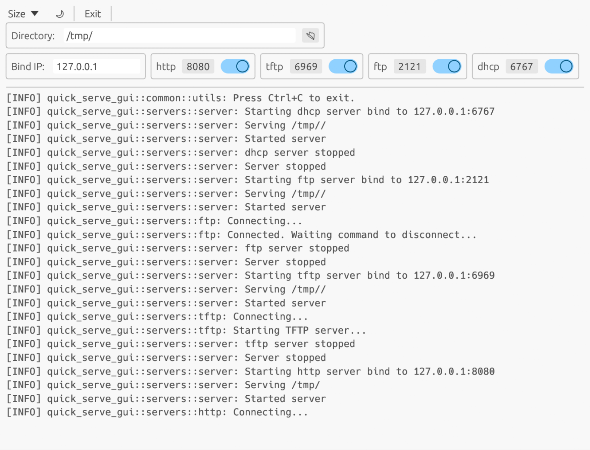
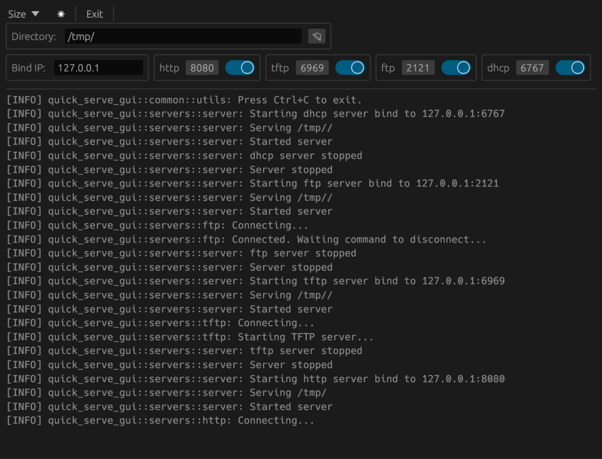

[](https://github.com/hah23255/quick-serve-enterprise/actions/workflows/rust.yml)
[](LICENSE)
[]()
[]()

<p align="center">
  <p align="center">  </p>
</p>

# Quick-serve Enterprise Edition

**Enterprise-hardened fork** of [quick-serve](https://github.com/joaofl/quick-serve) optimized for **production deployment** on Android/Termux with critical bug fixes, custom error pages, and comprehensive operational documentation.

No setup, zero-config, multi-platform, multi-protocol, standalone server for developers or whoever wants to promptly serve files over the network with production-grade reliability.

---

## 🏢 Enterprise Edition Features

### ✨ What Makes This "Enterprise"?

This fork extends the excellent upstream project with **production-grade enhancements** for real-world deployment:

#### 🐛 Critical Bug Fixes
- **HTTP directory crash fix** - Server no longer crashes when accessing directories without index.html
- Proper 403 Forbidden responses for directory access
- Submitted to upstream as [Issue #39](https://github.com/joaofl/quick-serve/issues/39)

#### 🧺 Human-Friendly DropBasket Interface
- **One-command installation** - `curl | bash` for instant setup
- **~/DropBasket/** folder - Human-friendly name (no technical jargon)
- **Desktop shortcuts** - Click-to-start with purple gradient basket icon (Linux)
- **Termux widgets** - Home screen widgets for Android (DropBasket-Start, DropBasket-Stop)
- **Simple commands** - `qs-start`, `qs-stop`, `qs-sync` (no complex paths)
- **Auto-sync between devices** - Share files across your network effortlessly
- **Non-standard ports** - Port 50080 by default (no conflicts)
- **Installation error handling** - Comprehensive troubleshooting guide

#### 🎨 Professional Custom Error Pages
- **403 Forbidden** - Professional styled page with purple gradient
- **404 Not Found** - Professional styled page with pink gradient
- **500 Internal Server Error** - Professional styled page with orange gradient
- All pages follow modern UI/UX principles

#### 📱 Android/Termux Production Optimizations
- **runit service integration** - Automatic startup and management
- **noexec filesystem workarounds** - Works on Android storage limitations
- **Optimized build scripts** - Cross-compilation support via V2 pattern
- **Production-ready deployment** - Battle-tested on ARM64 devices

#### 📚 Comprehensive Operational Documentation
- **[Simple Install Guide](docs/SIMPLE_INSTALL.md)** - One-command setup & DropBasket usage
- **[Installation Error Handling](INSTALL_GUIDELINES.md)** - Troubleshoot installation issues
- **[Deployment Guide](docs/DEPLOYMENT.md)** - Complete production setup
- **[Maintenance Guide](docs/MAINTENANCE.md)** - Weekly/monthly procedures
- **[Disaster Recovery](docs/DISASTER_RECOVERY.md)** - Emergency protocols
- **[Troubleshooting](docs/TROUBLESHOOTING.md)** - Common issues & solutions
- **[Monitoring Schedule](docs/MONITORING_SCHEDULE.md)** - Health check procedures
- **[Bug Report Guide](docs/BUG_REPORT.md)** - Issue reporting template

#### 🔧 Enterprise Tooling
- Simple commands (`qs-start`, `qs-stop`, `qs-sync`)
- One-command installers (install.sh, install-android.sh)
- Automated health checks
- Log rotation configuration
- Service monitoring scripts

---

## 🆚 Quick Comparison

| Feature | Upstream | Enterprise Edition |
|---------|----------|-------------------|
| **One-command installer** | ❌ Manual build | ✅ curl \| bash instant setup |
| **Human-friendly interface** | ❌ CLI only | ✅ DropBasket folder + desktop shortcuts |
| **Quick commands** | ❌ Full binary path | ✅ qs-start, qs-stop, qs-sync |
| **Custom error pages** | ❌ Generic | ✅ Professional styled (403/404/500) |
| **Directory crash bug** | ❌ Crashes | ✅ Fixed & handles gracefully |
| **Android/Termux docs** | ❌ Basic | ✅ Complete production guides |
| **Service management** | ❌ Manual | ✅ runit integration + aliases |
| **Monitoring tools** | ❌ None | ✅ Health checks + dashboards |
| **Disaster recovery** | ❌ None | ✅ Complete documented procedures |
| **Maintenance guides** | ❌ None | ✅ Scheduled procedures (weekly/monthly) |
| **Build workarounds** | ❌ Standard | ✅ Android noexec handling |

**Upstream Project:** [joaofl/quick-serve v0.3.2](https://github.com/joaofl/quick-serve)

---

## Table of Contents
- [Enterprise Features](#-enterprise-edition-features)
- [Quick Comparison](#-quick-comparison)
- [Motivation](#motivation)
- [Installation](#installation)
- [Usage](#usage)
- [Enterprise Documentation](#-enterprise-documentation)
- [Build Dependencies](#build-dependencies)
- [Using Cross](#using-cross)
- [Testing](#test)
- [Implementation Goals](#implementation-goals)
- [Contributing](#-contributing)
- [Contact & Support](#-contact--support)
- [License](#-license)

---

## Motivation

As an embedded software engineer, I routinely encounter the need for seamless file transfers between host and target devices in the course of various development tasks. Whether the objective is upgrading a system image, booting a Linux Kernel from the bootloader, retrieving packages from remote repositories, fetching a Git repository or sharing files with your colleague next desk, the constant requirement is a quick and straightforward file server. The capability to promptly set up an FTP, TFTP, or HTTP server proves to be a time-saving and efficient solution in navigating the most diverse file exchange scenarios.

This **Enterprise Edition** takes the original concept and adds production-ready features, comprehensive documentation, and battle-tested deployment procedures for Android/Termux environments.

---

## Installation

### 🚀 Quick Install (Recommended)

**One-command installation with DropBasket setup:**

#### Linux / Ubuntu / Debian
```bash
curl -sSL https://raw.githubusercontent.com/hah23255/quick-serve-enterprise/main/install.sh | bash
```

#### Termux on Android
```bash
curl -sSL https://raw.githubusercontent.com/hah23255/quick-serve-enterprise/main/install-android.sh | bash
```

**What gets installed:**
- ✅ Quick-serve binary (optimized, headless)
- ✅ **~/DropBasket/** folder 🧺 (human-friendly name)
- ✅ Desktop shortcut with icon (Linux)
- ✅ Termux home screen widgets (Android)
- ✅ Simple commands: **qs-start**, **qs-stop**, **qs-sync**
- ✅ Auto-configured on port 50080 (non-standard)
- ✅ Firewall auto-opened (Linux)

**Installation time:** 2-5 minutes | **Disk space:** ~100MB

📖 **Quick Start Guide:** [docs/SIMPLE_INSTALL.md](docs/SIMPLE_INSTALL.md)
🔧 **Error Handling:** [INSTALL_GUIDELINES.md](INSTALL_GUIDELINES.md)

---

### 🔧 Advanced: Manual Build (For Developers)

<details>
<summary>Click to expand manual build instructions</summary>

#### Option 1: Enterprise Edition Build

**For production deployment with all enterprise features:**

```bash
# Clone the Enterprise edition
git clone https://github.com/hah23255/quick-serve-enterprise.git
cd quick-serve-enterprise

# Build (headless, optimized for production)
cargo build --release --no-default-features --bin quick-serve

# Binary will be at: target/release/quick-serve
```

**For Android/Termux with noexec workaround:**

```bash
# Set build directory to exec-allowed location
export CARGO_TARGET_DIR=~/tmp/cargo-build
export TMPDIR=~/tmp

# Build
cargo build --release --no-default-features --bin quick-serve

# Deploy
cp ~/tmp/cargo-build/release/quick-serve ./bin/quick-serve
```

**See [DEPLOYMENT.md](docs/DEPLOYMENT.md) for complete production setup including service management.**

#### Option 2: Upstream Version (Basic Features)

**For quick testing without enterprise features:**

```bash
# Install from crates.io (upstream version)
cargo install quick-serve

# Or build from upstream source
git clone https://github.com/joaofl/quick-serve.git
cd quick-serve
cargo run --release
```

**Note:** This installs the upstream version without:
- Custom error pages
- Directory crash fix
- Enterprise documentation
- Android/Termux optimizations
- DropBasket human-friendly interface

</details>

---

## Usage

### 🧺 Simple Commands (After Quick Install)

**Start server (serves ~/DropBasket/ on port 50080):**
```bash
qs-start
# Server running at http://YOUR_IP:50080
# Access from any device on your network
```

**Stop server:**
```bash
qs-stop
```

**Sync files from another device:**
```bash
qs-sync 192.168.1.120
# Downloads all files from another DropBasket server
```

**Share files:** Just copy to ~/DropBasket/ folder 🧺

---

### 🖥️ Advanced Usage

It can be used both headless or for an even more friendly experience, it can be used with a GUI:

<p align="center">
  
  
</p>

**Command line options:**
```shell
Options:
      --headless          Headless
  -b, --bind-ip=<IP>      Bind IP [default: 127.0.0.1]
  -d, --serve-dir=<PATH>  Directory to serve [default: /tmp/]
  -v, --verbose...        Verbose logging
      --http[=<PORT>]     Start the HTTP server [default port: 8080]
      --ftp[=<PORT>]      Start the FTP server [default port: 2121]
      --tftp[=<PORT>]     Start the TFTP server [default port: 6969]
      --dhcp[=<PORT>]     Start the DHCP server [default port: 6767]
  -h, --help              Print help (see more with '--help')
  -V, --version           Print version
```

**Examples:**
```bash
# Serve on different port
qs-start 51234

# Use different directory
quick-serve --headless --http=8080 -d ~/Documents

# Multiple protocols
quick-serve --headless --http --ftp --tftp -d ~/shared
```

---

## 📚 Enterprise Documentation

This enterprise fork includes comprehensive operational documentation for production deployments:

### Quick Reference Guides

| Document | Purpose | Audience |
|----------|---------|----------|
| **[DEPLOYMENT.md](docs/DEPLOYMENT.md)** | Production setup, service management, configuration | DevOps, System Admins |
| **[MAINTENANCE.md](docs/MAINTENANCE.md)** | Weekly/monthly maintenance procedures | System Admins |
| **[TROUBLESHOOTING.md](docs/TROUBLESHOOTING.md)** | Common issues and solutions | Everyone |
| **[DISASTER_RECOVERY.md](docs/DISASTER_RECOVERY.md)** | Emergency recovery procedures | System Admins, On-Call |
| **[MONITORING_SCHEDULE.md](docs/MONITORING_SCHEDULE.md)** | Health check schedules and procedures | DevOps, SRE |
| **[BUG_REPORT.md](docs/BUG_REPORT.md)** | Issue reporting template | Developers |

### Production Deployment Checklist

- [ ] Read [DEPLOYMENT.md](docs/DEPLOYMENT.md)
- [ ] Configure `config/production.env`
- [ ] Set up service management (runit)
- [ ] Configure log rotation
- [ ] Set up convenience aliases
- [ ] Test health checks
- [ ] Review disaster recovery procedures
- [ ] Schedule maintenance windows

**Getting Started:** Start with [DEPLOYMENT.md](docs/DEPLOYMENT.md) for step-by-step production setup.

---

## Build Dependencies

### Fedora
```sh
sudo dnf install glibc2-devel atk-devel cairo-devel pango-devel gdk-pixbuf2-devel gtk3-devel gcc cmake clang clang-libs
```

### Ubuntu
```sh
sudo apt install libatk1.0-dev libcairo2-dev libpango1.0-dev libgdk-pixbuf2.0-dev libgtk-3-dev build-essential
```

**Note:** The `ui` is optional and can be excluded from compilation with `--no-default-features` flag.

---

## Using cross

- Install Docker
- Install Cross
```bash
cargo install cross --git https://github.com/cross-rs/cross
```

- Build
```sh
./cross-build-all.sh
```

---

## Test

```sh
sudo apt install wget tftp-hpa
cargo build
cargo test
```

---

## Implementation Goals

### Supported Protocols
- [x] FTP
- [x] HTTP
- [x] TFTP
- [x] DHCP
- [ ] HTTPS
- [ ] SFTP
- [ ] NFS
- [ ] SAMBA

### Interface
- [x] Command line
- [x] Local interface
- [ ] Web interface
- [ ] Terminal interface

### Functionalities
- [ ] Serve `n` files and exit
- [ ] Serve for `t` seconds and exit
- [ ] Show number of files being served
- [ ] Report transfer rate
- [ ] Report transferred files
- [ ] Show statistics when exit
- [ ] Color-code logs according to protocol
- [ ] Add log filtering options

### Enterprise Additions (Completed)
- [x] Fix excessive CPU usage when using the UI
- [x] Custom error pages (403, 404, 500)
- [x] Production deployment documentation
- [x] Service management integration (runit)
- [x] Health check scripts
- [x] Maintenance procedures

### Enterprise Additions (Planned)
- [ ] Basic authentication support
- [ ] HTTPS/TLS support
- [ ] Styled directory listing (optional)
- [ ] Rate limiting
- [ ] Prometheus metrics endpoint
- [ ] Health check endpoint (/health)

---

## 🤝 Contributing

We welcome contributions! See [CONTRIBUTING.md](CONTRIBUTING.md) for guidelines.

**Ways to contribute:**
- 🐛 Report bugs using [docs/BUG_REPORT.md](docs/BUG_REPORT.md) template
- 💡 Suggest enterprise features (deployment, monitoring, operations)
- 🔧 Submit bug fixes and improvements
- 📖 Enhance documentation
- 🧪 Add test cases for Android/Termux
- 🌍 Platform-specific optimizations

**Scope Note:** This fork focuses on **production deployment features**. General feature requests should go to the [upstream project](https://github.com/joaofl/quick-serve).

---

## 📞 Contact & Support

### Enterprise Edition

**Maintainer:** Hristo Hristov
**LinkedIn:** [linkedin.com/in/hristo-hristov-93868648](https://www.linkedin.com/in/hristo-hristov-93868648)
**Website:** [www.ccvs.tech](https://www.ccvs.tech)

**Issues & Bug Reports:**
[GitHub Issues](https://github.com/hah23255/quick-serve-enterprise/issues) - Please use [docs/BUG_REPORT.md](docs/BUG_REPORT.md) template

**Contributing:**
See [CONTRIBUTING.md](CONTRIBUTING.md) for guidelines on:
- Bug fixes and improvements
- Documentation enhancements
- Platform-specific optimizations

### Upstream Project

**Original Author:** João Loureiro
**Repository:** [github.com/joaofl/quick-serve](https://github.com/joaofl/quick-serve)
**Version:** Based on v0.3.2

**Feature Requests:** Please direct general feature requests to the upstream project.
**Bug Fixes:** Critical bugs discovered here are submitted upstream (e.g., Issue #39).

---

## 📄 License

This project is licensed under the MIT License - see the [LICENSE](LICENSE) file for details.

**Enterprise modifications** Copyright (c) 2025 Hristo Hristov
**Original project** Copyright (c) 2024 João Loureiro

---

## 🙏 Acknowledgments

- **João Loureiro** - Original quick-serve project and excellent foundation
- **Rust Community** - Amazing ecosystem and tooling
- **Android/Termux Community** - Platform support and testing

---

## ⭐ Star History

If this enterprise fork helped your production deployment, please star the repository!

[](https://github.com/hah23255/quick-serve-enterprise)

---

**Built with ❤️ for production deployments**

*Enterprise-grade file serving for embedded systems and mobile devices*
